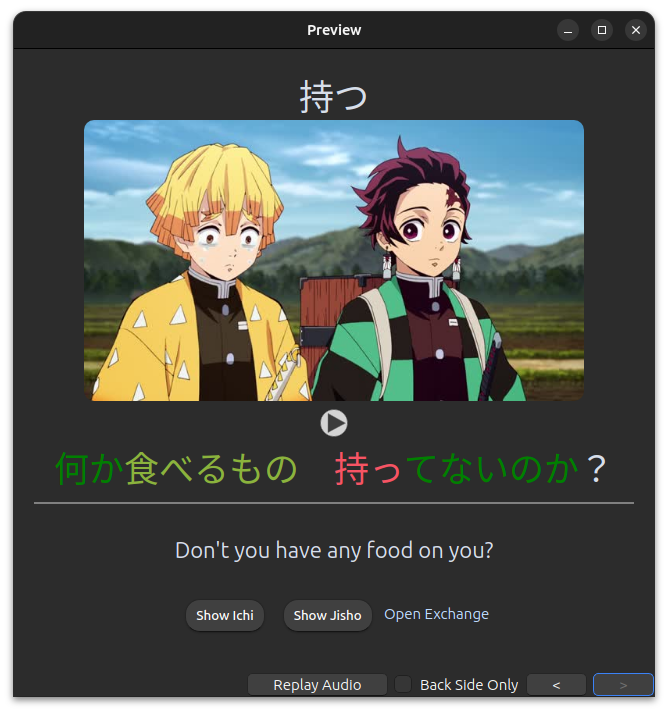

# Japanese to English Sentences Anki Deck

[Google Drive Download (2.2GB)](https://drive.google.com/file/d/1P8TYCngSn50WMMXPVk_QtEj_kvKjic4o/view?usp=sharing
)

The deck contains ~37K japanese to english sentences. It has the following sub-decks:

* Demon Slayer S1 (4K)
* Mob Psycho S1 (4K)
* One Piece S3 (3K)
* One Punch Man S1 (3K)
* Shirokuma Cafe (15K)
* Vinland Saga S1 (6K)

The cards were gathered
from [Anime Sentence Banks](https://www.mediafire.com/folder/p17g5uk4phb41/User_Uploaded_Anki_Decks) and then adjusted
to make them work with the [Morphman add-on](https://ankiweb.net/shared/info/900801631) to improve the learning
workflow. The back of the cards include automatically color-coded words (morphs) based om how well you know them, buttons to show/hide embedded dictionaries and a link to open Japanese Stack Exchange. Text
added to the field 'my_notes' will be shown in a box under the english translation.

You have to [change one deck-option to prevent audio to play twice](#prevent-duplicate-audio).

## Dark-mode
### Front

### Back

### Added Notes

### Opened Dictionary

## Light-mode
### Front

### Back

### Added Notes

### Opened Dictionary

## Prevent Duplicate Audio

To prevent the audio playing twice do the following:
1. Go to deck-options
2. Scroll down to the "Audio" section
3. Activate "Skip question when replaying answer"